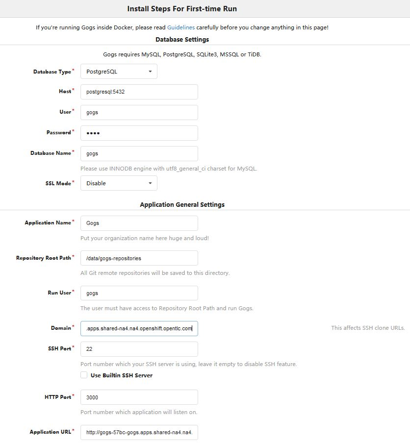

# Prepare CI/CD environment

## Check External Route for Registry

By default the external route for image registry is not created in an OpenShift 4 cluster. We need it in some of our exercises so we have created it beforehand in our lab environment. Check if you can access it by inspecting one of the existing images.

```
# Set your REGISTRY variable to the proper route export 
REGISTRY=default-route-openshift-image-registry.apps.$(oc whoami --show-server | cut -d. -f2- | cut -d: -f1) 
echo ${REGISTRY}

# Log into the registry using Podman, use your username and the token as the password
podman login -u $(oc whoami) -p $(oc whoami -t) ${REGISTRY}
```

After that try to run the `skopeo` command to confirm you can access the registry.

```
skopeo inspect docker://${REGISTRY}/openshift/python
```

## Pre-configuration

Check the `GUID` variable

```
echo $GUID
```

If empty, define it using unique value (e.g. using the GUID received from OPENTLC)

```
export GUID=57bc
```

You can also add this to the `.bashrc` file

```
echo "export GUID=57bc" >> ~/.bashrc
```

## Set up Gogs 

[Gogs](https://gogs.io/) is a self-hosted Git service. Use this step if no access to the final git repository is available.

### Set Up Project and Database and Install Gogs

Set up the project, database, and Gogs pod:

```
oc new-project $GUID-gogs --display-name "Shared Gogs"
oc new-app postgresql-persistent --param POSTGRESQL_DATABASE=gogs --param POSTGRESQL_USER=gogs --param POSTGRESQL_PASSWORD=gogs --param VOLUME_CAPACITY=4Gi -lapp=postgresql_gogs
```
Wait until the database pod is running. Set up Gogs pod:

```
oc new-app wkulhanek/gogs:11.86 -lapp=gogs
oc rollout pause dc gogs
```

Change the deployment strategy from Rolling to Recreate 

```
oc patch dc gogs --patch='{ "spec": { "strategy": { "type": "Recreate" }}}'
```

Create a persistent volume claim of 4G and connect it to /data

```
oc set volume dc/gogs --add --overwrite --name=gogs-volume-1 --type persistentVolumeClaim --claim-size=4G --claim-name=gogs-data
```

Expose the service as a route:

```
oc expose svc gogs
```

Finally, resume deployment of the Gogs deployment to roll out all changes at once.

```
oc rollout resume dc gogs
```

Display the route

```
oc get route gogs
```
     
Use the value for `$GOGSROUTE`. Navigate to `$GOGSROUTE`. Set up Gogs with these values:
- Database Type: PostgreSQL
- Host: postgresql:5432
- User: gogs
- Password: gogs
- Database Name: gogs
- Run User: gogs
- Application URL: `http://$GOGSROUTE`



### Make Gogs Pod Resilient to Restarts

Examine the generated `app.ini` file:


```
oc exec $(oc get pod | grep "^gogs" | grep Running | awk '{print $1}') -- cat /opt/gogs/custom/conf/app.ini | more
```

Copy the `app.ini` file to your local home directory:


```
oc cp $(oc get pod | grep "^gogs" | grep Running | awk '{print $1}'):opt/gogs/custom/conf/app.ini $HOME/app.ini
```

Create the ConfigMap with the `app.ini` file and mount it as a volume into the pod:


```
oc create configmap gogs --from-file=$HOME/app.ini
oc set volume dc/gogs --add --overwrite --name=config-volume -m /opt/gogs/custom/conf/ -t configmap --configmap-name=gogs
rm -f app.ini
```

Wait until the redeployment finishes.