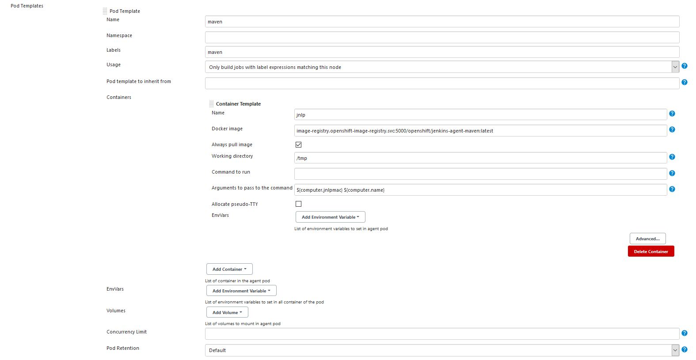
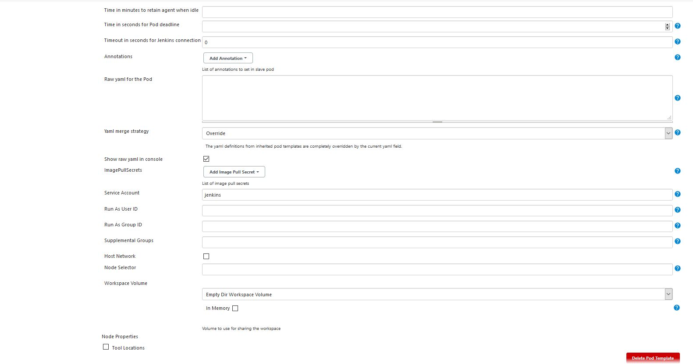

# Set up Jenkins

## Deploy Jenkins

Create a new project

```
oc new-project ${GUID}-jenkins --display-name "Shared Jenkins"
```

Create a new persistent Jenkins instance with the following requirements:
- A persistent persistent volume claim of 4 GB.
- Set the parameter `DISABLE_ADMINISTRATIVE_MONITORS=true` to turn of update checking of Jenkins plugins.
- Set the CPU request to 500m and CPU limit to 2 cores.
- Set the memory request to 1Gi and memory limit to 2Gi.

```
oc new-app jenkins-persistent --param ENABLE_OAUTH=true --param MEMORY_LIMIT=2Gi --param VOLUME_CAPACITY=4Gi --param DISABLE_ADMINISTRATIVE_MONITORS=true

oc set resources dc jenkins --limits=memory=2Gi,cpu=2 --requests=memory=1Gi,cpu=500m
```

# Test Jenkins

To test the Jenkins deployment you will create a simple pipeline using the default maven slave. Login into Jenkins instamce via SSO using your OpenShift credentials. To get the route type

```
oc get route -n ${GUID}-jenkins
```

### Check the **`maven`** agent pod configuration

Check the **maven** pod template with preinstalled Java and Maven, which is used to create a Jenkins slave where the sample application will be built.  

- From the Jenkins home screen, select **Manage Jenkins**.
- Dismiss all warnings
- Select Manage Nodes and **Clouds → Configure Clouds**
- Select **Pod Templates**, next **maven** → **Pod Template details...**
- Check that following values are set
  - Name: **`maven`**
  - Namespace: **`<empty>`**
  - Labels: **`maven`**
  - Usage: **Only build jobs with label expressions matching this node**
  - The name of the pod template to inherit from: **`<empty>`**
  - **Containers → Container Template**
    - Name: **`jnlp`**
    - Docker image: **`image-registry.openshift-image-registry.svc:5000/openshift/jenkins-agent-maven:latest`**
    - Always pull image: **`<Checked>`**
    - Working directory: **`/tmp`**
    - Command to run: **`<empty>`**
    - Arguments to pass to the command: **`${computer.jnlpmac} ${computer.name}`**
    - Allocate pseudo-TTY: **`<Unchecked>`**
  - Near the bottom of the pod template definition (just above **Delete Template**).
    - Service Account: **`jenkins`**

You can also ser here the memory and cpu limits

- Click Advanced… to open the advanced container template settings.
  - Request CPU: **`1`**
  - Request Memory: **`1Gi`**
  - Limit CPU: **`2`**
  - Limit Memory: **`2Gi`**




### Test the **`maven`** agent pod

Using a simple pipeline, you can now test that the agent pod is working properly

- Create a new Jenkins job **Test Agent** of type **Pipeline** and use this test pipeline:
  - Make sure the label you request matches the label from the agent definition.

    ```
    node('maven') {
      stage('Test skopeo') {
        sh("mvn -v")
        sh("java -version")
        sh("oc whoami")
      }
    }
    ```
- Run the pipeline (click **Build Now**)
  - In the console output you should see the output of **maven** and **java**. You can see **OpenJDK 11** is used as default JDK
    ```
    + java -version
    openjdk version "11.0.8" 2020-07-14 LTS
    ```
  - The **openshift-tasks** application requires **JDK 8**. To change the version go to the **maven** agent pod definition, next **EnvVars: → Add Environment Variable**
    - Key: **`USE_JAVA_VERSION`**
    - Value: **`java-1.8.0`**

    Run the pipeline again. You can see **OpenJDK 8** is used now
    ```
    + java -version
    openjdk version "1.8.0_262"
    ```
  
