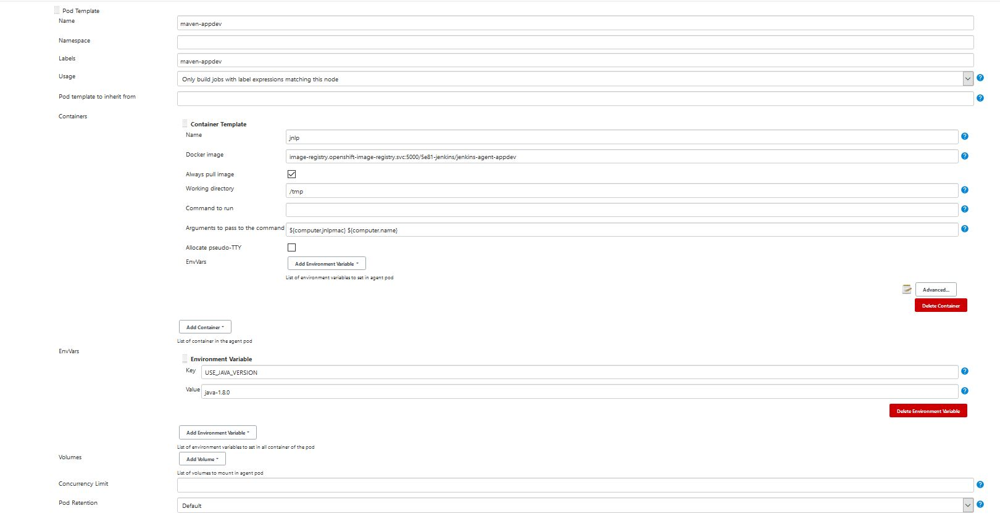
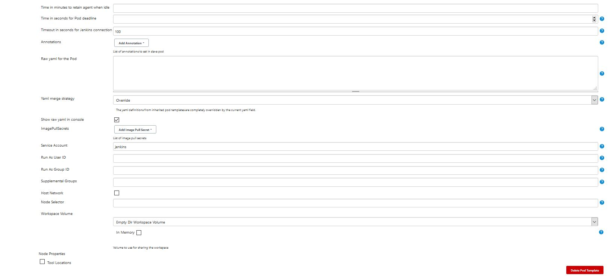

# Work with Custom Jenkins Agent Pod

Usually you need some additional tools installed on the agent pod. You must build a custom image for the agent pod. Inm this sample you will create and use a pod with installed **skopeo**.

## Create Custom Jenkins Agent Pod

To create a custom Jenkins agent pod we will use the OpenShift build process with Docker strategy. It is much easier than building the container image locally and then pushing it to the Docker registry.

- Check the location of the original image for the maven agent pod used in the previous example. This image will be used as base image for your custom image

    ```
    oc get is jenkins-agent-maven -n openshift -o yaml | grep dockerImageRepository
    ```

    You should get following output

    ```
    dockerImageRepository: image-registry.openshift-image-registry.svc:5000/openshift/jenkins-agent-maven
    ```

- Check the available tags of this image

    ```
    oc get is jenkins-agent-maven -n openshift -o yaml | grep tag:
    ```

    You should get following output

    ```
    tag: latest
    tag: v4.0
    ```


- Create a `Dockerfile` with following content (you can find the file under `jenkins/agents/jenkins-agent-appdev` directory)

    ```
    FROM registry.access.redhat.com/ubi8/go-toolset:latest as builder

    ENV SKOPEO_VERSION=v1.0.0
    RUN git clone -b $SKOPEO_VERSION https://github.com/containers/skopeo.git && cd skopeo/ && make binary-local DISABLE_CGO=1

    FROM image-registry.openshift-image-registry.svc:5000/openshift/jenkins-agent-maven:v4.0 as final   

    USER root

    RUN mkdir /etc/containers
    COPY --from=builder /opt/app-root/src/skopeo/default-policy.json /etc/containers/policy.json
    COPY --from=builder /opt/app-root/src/skopeo/skopeo /usr/bin

    USER 1001
    ```
- Create a build config using the `Dockerfile`

    ```
    cat Dockerfile | oc new-build --strategy=docker --name=jenkins-agent-appdev -D -
    ```
    This command will build the image and automatically upload it to the cluster’s internal container registry. It will also create an ImageStream. Check it:

    ```
    oc get is
    ```
    You should get following output

    ```
    NAME                   IMAGE REPOSITORY                                                                                                     TAGS     UPDATED
    jenkins-agent-appdev   default-route-openshift-image-registry.apps.shared-na4.na4.openshift.opentlc.com/5e81-jenkins/jenkins-agent-appdev   latest   44 minutes ago
    jenkins-agent-maven    default-route-openshift-image-registry.apps.shared-na4.na4.openshift.opentlc.com/5e81-jenkins/jenkins-agent-maven    v4.0     46 minutes ago
    ```

- Get the internal url of the `jenkins-agent-appdev` image

    ```
    oc get is jenkins-agent-appdev -o yaml | grep dockerImageRepository
    ```
    Sample output:
    ```
    dockerImageRepository: image-registry.openshift-image-registry.svc:5000/5e81-jenkins/jenkins-agent-appdev
    ```

## Register Custom Agent Pod in Jenkins

When your customized Maven agent pod is available in the OpenShift Container Registry, you need to tell Jenkins where to find it and when to use it.

You can use the existing **maven** agent image as a template and copy most of the fields from the existing image.

In the Jenkins UI:
- Select **Manage Jenkins**.
- Dismiss all warnings
- Select **Manage Nodes and Clouds → Configure Clouds**
- Scroll down to the **Add Pod Template** button.
- Select **Add Pod Template → Kubernetes Pod Template** to add a new Pod Template.

Make sure you get the following settings right:
- Labels: This is the name that you use in your pipeline to specify this image. Suggestion: **`maven-appdev`**.
- Docker-Image: The fully qualified name of your container image. Use the OpenShift internal service name (and port). You can find the right name in the ImageStream (**dockerImageRepository**).
- Memory: Use **1Gi** for the container memory request and **2Gi** for the limit.
- CPU: Use **1** for the cpu request and **2** for the cpu limit.
- Service Account: The service account for the pod to use should be set to **jenkins**.
- Add an Environment Variable: **USE_JAVA_VERSION = java-1.8.0**

- Check that following values are set
  - Name: **`maven-appdev`**
  - Namespace: **`<empty>`**
  - Labels: **`maven-appdev`**
  - Usage: **Only build jobs with label expressions matching this node**
  - The name of the pod template to inherit from: **`<empty>`**
  - **Containers → Container Template**
    - Name: **`jnlp`**
    - Docker image: **`image-registry.openshift-image-registry.svc:5000/GUID-jenkins/jenkins-agent-appdev:latest`** (**GUID** should be adjusted correctly)
    - Always pull image: **`<Checked>`**
    - Working directory: **`/tmp`**
    - Command to run: **`<empty>`**
    - Arguments to pass to the command: **`${computer.jnlpmac} ${computer.name}`**
    - Allocate pseudo-TTY: **`<Unchecked>`**
  - Near the bottom of the pod template definition (just above **Delete Template**).
    - Service Account: **`jenkins`**
  - Click Advanced… to open the advanced container template settings.
    - Request CPU: **`1`**
    - Request Memory: **`1Gi`**
    - Limit CPU: **`2`**
    - Limit Memory: **`2Gi`**
  - **EnvVars** contains following variable
    - Key: **`USE_JAVA_VERSION`**
    - Value: **`java-1.8.0`**




## Test Custom Agent Pod

Using a simple pipeline, you can now test that your agent pod is working properly and has **skopeo** installed.

- Change the Jenkins jon **Test Agent** and use this test pipeline
  - Make sure the label you request matches the label from the agent definition.

    ```
    node('maven-appdev') {
      stage('Test skopeo') {
        sh("mvn -v")
        sh("java -version")
        sh("oc whoami")
        sh("skopeo --version")
      }
    }
    ```
- Run the pipeline (click **Build Now**)
  - You should see following entry in the console output

    ```
    + skopeo --version
    skopeo version 0.1.40
    ```

## Use a ConfigMap to register Agent Pod

When deploying the Jenkins environment programmatically you can not edit the system configuration like you did above. Therefore you will need to either embed the podTemplate definition into the Jenkins Pipeline - or create a ConfigMap with the definition for the pod template.

- Create an XML File `maven-skopeo-agent.xml` for your pod Template. Ensure the following parameters are set:
    - Labels: Use **maven-skopeo-agent** as the name that you use in your pipeline to specify this image..
    - Docker-Image: The fully qualified name of your container image. Use the OpenShift internal service name (and port). You can find the right name in the ImageStream (**dockerImageRepository**).
    - Memory: Use **1Gi** for the container memory request and **2Gi** for the limit.
    - CPU: Use **1** for the cpu request and **2** for the cpu limit.
    - Service Account: The service account for the pod to use should be set to **jenkins**.
    - Add an Environment Variable: **USE_JAVA_VERSION = java-1.8.0**

    ```
    <org.csanchez.jenkins.plugins.kubernetes.PodTemplate>
        <inheritFrom></inheritFrom>
        <name>maven-skopeo-agent</name>
        <privileged>false</privileged>
        <capOnlyOnAlivePods>false</capOnlyOnAlivePods>
        <alwaysPullImage>false</alwaysPullImage>
        <instanceCap>2147483647</instanceCap>
        <slaveConnectTimeout>0</slaveConnectTimeout>
        <idleMinutes>0</idleMinutes>
        <activeDeadlineSeconds>0</activeDeadlineSeconds>
        <label>maven-skopeo-agent</label>
        <serviceAccount>jenkins</serviceAccount>
        <nodeSelector></nodeSelector>
        <customWorkspaceVolumeEnabled>false</customWorkspaceVolumeEnabled>
        <workspaceVolume class="org.csanchez.jenkins.plugins.kubernetes.volumes.workspace.EmptyDirWorkspaceVolume">
            <memory>false</memory>
        </workspaceVolume>
        <containers>
            <org.csanchez.jenkins.plugins.kubernetes.ContainerTemplate>
            <name>jnlp</name>
            <image>image-registry.openshift-image-registry.svc:5000/GUID-jenkins/jenkins-agent-appdev:latest</image>
            <privileged>false</privileged>
            <alwaysPullImage>true</alwaysPullImage>
            <workingDir>/tmp</workingDir>
            <command></command>
            <args>${computer.jnlpmac} ${computer.name}</args>
            <ttyEnabled>false</ttyEnabled>
            <resourceRequestCpu>2</resourceRequestCpu>
            <resourceRequestMemory>2048Mi</resourceRequestMemory>
            <resourceLimitCpu>2</resourceLimitCpu>
            <resourceLimitMemory>2048Mi</resourceLimitMemory>
            <envVars>
                <!-- Default java is java-11 -->
                <org.csanchez.jenkins.plugins.kubernetes.model.KeyValueEnvVar>
                <key>USE_JAVA_VERSION</key>
                <value>java-1.8.0</value>
                </org.csanchez.jenkins.plugins.kubernetes.model.KeyValueEnvVar>
            </envVars>
            <ports />
            <livenessProbe>
                <execArgs></execArgs>
                <timeoutSeconds>0</timeoutSeconds>
                <initialDelaySeconds>0</initialDelaySeconds>
                <failureThreshold>0</failureThreshold>
                <periodSeconds>0</periodSeconds>
                <successThreshold>0</successThreshold>
            </livenessProbe>
            </org.csanchez.jenkins.plugins.kubernetes.ContainerTemplate>
        </containers>
        <envVars />
        <annotations />
        <imagePullSecrets />
        <nodeProperties />
        <yaml></yaml>
        <showRawYaml>true</showRawYaml>
        <podRetention class="org.csanchez.jenkins.plugins.kubernetes.pod.retention.Default" />
    </org.csanchez.jenkins.plugins.kubernetes.PodTemplate>
    ```
    You can find the file under `jenkins/agents/jenkins-agent-appdev` directory. Please adjust the file by providing the correct **GUID**.

- Create a ConfigMap called **maven-skopeo-agent** containing the file `maven-skopeo-agent.xml`.

    ```
    oc create configmap maven-skopeo-agent --from-file=maven-skopeo-agent.xml
    ```

- Label the ConfigMap with role=jenkins-slave for Jenkins to pick up the definition

    ```
    oc label configmap maven-skopeo-agent role=jenkins-slave
    ```


## Test the Second Agent Pod

If you want you can double check that the OpenShift sync plugin updated the Jenkins configuration. Simply check under **Manage Jenkins → Manage Nodes and Clouds → Configure Clouds** to validate that you now have four pod templates defined.

Using a simple pipeline, you can once again test that your agent pod is working properly and has **skopeo** installed. This time use label **maven-skopeo-agent**.

- Change the Jenkins jon **Test Agent** and use this test pipeline
  - Make sure the label you request matches the label from the agent definition.

    ```
    node('maven-skopeo-agent') {
      stage('Test skopeo') {
        sh("mvn -v")
        sh("java -version")
        sh("oc whoami")
        sh("skopeo --version")
      }
    }
    ```
- Run the pipeline (click **Build Now**)
  - You should see following entry in the console output

    ```
    + skopeo --version
    skopeo version 0.1.40
    ```
